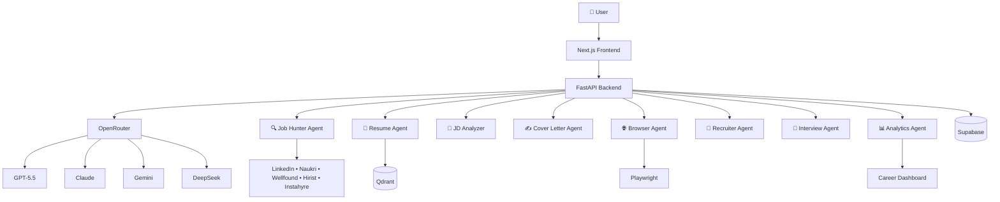
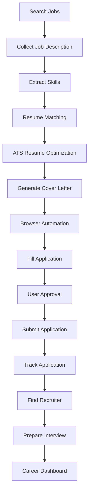

# ⚔️ Karna OS

> **An Autonomous Multi-Agent AI Career Operating System that intelligently discovers opportunities, analyzes job descriptions, optimizes resumes, automates applications, prepares interview strategies, and manages the complete job search lifecycle.**

<p align="center">


</p>

---

# 🛡️ What is Karna OS?

**Karna OS** is an AI-powered Career Operating System that transforms the traditional job search into an intelligent, automated workflow.

Instead of manually searching for jobs, tailoring resumes, filling repetitive applications, tracking opportunities, and preparing for interviews, Karna OS coordinates specialized AI agents that work together to assist throughout the career journey.

The platform combines modern Large Language Models (LLMs), browser automation, retrieval systems, intelligent workflows, and analytics to reduce repetitive tasks while helping users focus on high-value activities such as networking and interview preparation.

---

# 🎯 Mission

Build an intelligent AI operating system that acts as a personal career assistant capable of:

- Discovering relevant job opportunities
- Understanding job descriptions
- Optimizing resumes for ATS
- Generating personalized cover letters
- Assisting with job applications
- Tracking application progress
- Supporting recruiter outreach
- Preparing personalized interview plans
- Providing career insights through analytics

---

# ⚡ Why "Karna"?

Karna, one of the greatest warriors in the Mahabharata, is remembered for his perseverance, discipline, loyalty, and relentless pursuit of excellence despite adversity.

Inspired by these qualities, **Karna OS** represents an AI system designed to work tirelessly on behalf of users, helping them navigate their career journey with consistency, intelligence, and determination.

---
# 📖 Introduction

Finding the right job has become increasingly challenging due to fragmented job portals, repetitive application processes, ATS filtering, and highly competitive hiring.

Candidates often spend hours every day searching multiple websites, tailoring resumes, writing cover letters, filling repetitive forms, tracking applications, and preparing for interviews.

**AI Career Copilot** is an autonomous multi-agent platform designed to simplify this entire workflow.

Instead of acting as a chatbot, the system functions as an intelligent AI assistant capable of discovering relevant opportunities, understanding job descriptions, generating ATS-optimized resumes, assisting with applications, preparing interview strategies, and maintaining a centralized dashboard for career management.

The platform combines **Generative AI**, **LLM orchestration**, **browser automation**, **vector search**, and **multi-agent reasoning** into a single unified application.

# 🎯 Vision

Our vision is to build an intelligent AI-powered career assistant that minimizes manual effort throughout the job search process while maximizing application quality and interview success.

The platform aims to:

- 🔍 Discover highly relevant jobs automatically
- 📄 Generate ATS-optimized resumes
- ✍️ Create personalized cover letters
- 🤖 Automate repetitive job applications
- 💬 Assist with recruiter outreach
- 📚 Prepare personalized interview material
- 📈 Analyze application performance
- 🧠 Continuously improve through intelligent feedback

# ✨ Features

## 🔎 Intelligent Job Discovery

- Search multiple job portals automatically
- Remove duplicate listings
- Detect newly posted jobs
- Apply advanced filtering
- Rank jobs based on resume similarity

---

## 📄 Resume Intelligence

- ATS Optimization
- Resume Keyword Matching
- Skill Gap Analysis
- Resume Version Management
- Dynamic Resume Generation

---

## ✍️ Cover Letter Generator

- Company-specific cover letters
- Job-specific personalization
- Recruiter-focused writing
- Professional formatting

---

## 🤖 Browser Automation

- Open application portals
- Upload resumes
- Upload cover letters
- Fill repetitive forms
- Complete applications
- Pause before final submission

---

## 💬 Recruiter Assistant

- Find recruiters
- Generate personalized messages
- Draft follow-up emails
- Schedule reminders

---

## 🎤 Interview Preparation

- Company Research
- Coding Questions
- ML Questions
- GenAI Questions
- Mock Interviews
- Revision Notes

---

## 📊 Career Dashboard

- Applications
- Interviews
- ATS Scores
- Salary Analytics
- Response Rate
- Follow-up Tracking

# 🤖 Multi-Agent Architecture

The system is built using specialized AI agents, each responsible for a dedicated task.

| Agent | Responsibility |
|--------|----------------|
| 🔍 Job Hunter | Searches job portals |
| 📄 Resume Agent | ATS optimization |
| 🧠 JD Analyzer | Understands job descriptions |
| ✍️ Cover Letter Agent | Generates personalized cover letters |
| 🌐 Browser Agent | Automates applications |
| 👥 Recruiter Agent | Finds recruiters & drafts messages |
| 🎤 Interview Agent | Generates interview preparation |
| 📊 Analytics Agent | Tracks career progress |

# 🏗️ System Architecture


# 🛠️ Technology Stack

## Frontend

- Next.js
- React
- TypeScript
- Tailwind CSS
- shadcn/ui

---

## Backend

- FastAPI
- Python
- AsyncIO

---

## AI & LLM

- OpenRouter
- OpenAI GPT-5.5
- Claude
- Gemini
- LangChain
- LangGraph

---

## Vector Database

- Qdrant

---

## Database

- Supabase
- PostgreSQL

---

## Browser Automation

- Playwright

---

## Workflow Automation

- n8n

---

## Deployment

- Docker
- Vercel
- Railway

# 📂 Project Structure

```text
AI-Career-Copilot/

├── frontend/
│   ├── app/
│   ├── components/
│   ├── hooks/
│   ├── lib/
│   └── styles/
│
├── backend/
│   ├── api/
│   ├── services/
│   ├── utils/
│   ├── models/
│   └── schemas/
│
├── agents/
│   ├── job_hunter/
│   ├── jd_analyzer/
│   ├── resume_optimizer/
│   ├── cover_letter/
│   ├── recruiter/
│   ├── interview/
│   └── analytics/
│
├── prompts/
├── workflows/
├── vectorstore/
├── database/
├── docs/
├── resume/
├── tests/
├── docker/
│
├── .env.example
├── requirements.txt
├── docker-compose.yml
└── README.md
```

# 🔄 Application Workflow



# ⚙️ Installation

## Clone Repository

```bash
git clone https://github.com/yourusername/AI-Career-Copilot.git

cd AI-Career-Copilot
```

---

## Create Virtual Environment

```bash
python -m venv .venv
```

Windows

```bash
.venv\Scripts\activate
```

Linux / Mac

```bash
source .venv/bin/activate
```

---

## Install Dependencies

```bash
pip install -r requirements.txt
```

---

## Start Backend

```bash
uvicorn main:app --reload
```

---

## Start Frontend

```bash
npm install

npm run dev
```

# 🔧 Configuration

Create a `.env` file.

```env
OPENROUTER_API_KEY=

SUPABASE_URL=

SUPABASE_KEY=

QDRANT_URL=

QDRANT_API_KEY=

PLAYWRIGHT_HEADLESS=false

DATABASE_URL=
```

The application is designed to work with multiple LLM providers through OpenRouter, allowing models to be switched without changing the application code.

# 🚀 Roadmap

## Phase 1

- Project Setup
- Database
- Authentication
- Job Discovery

---

## Phase 2

- Resume Matching
- ATS Optimization
- Cover Letter Generation

---

## Phase 3

- Browser Automation
- Application Assistant

---

## Phase 4

- Recruiter Outreach
- Interview Preparation

---

## Phase 5

- Analytics Dashboard
- Notifications
- Performance Insights
# 💡 Future Enhancements

- AI Resume Reviewer
- Salary Prediction
- Company Research Assistant
- LinkedIn Profile Optimizer
- AI Mock Interview
- Referral Recommendation Engine
- Chrome Extension
- Mobile Application
- Voice Assistant
- Learning Roadmap Generator
- Portfolio Reviewer
- Multi-language Support
- Calendar Integration

# 🤝 Contributing

Contributions are welcome.

If you would like to improve this project:

1. Fork the repository.
2. Create a feature branch.
3. Commit your changes.
4. Push your branch.
5. Open a Pull Request.

Please follow clean coding practices, write meaningful commit messages, and include documentation for major features.

# 📄 License

This project is licensed under the MIT License.

You are free to use, modify, and distribute this software in accordance with the terms of the MIT License.

# 🌟 Acknowledgements

This project leverages ideas and technologies from the open-source AI ecosystem.

Special thanks to the communities and projects behind:

- OpenAI
- Anthropic
- Google AI
- LangChain
- LangGraph
- Qdrant
- Supabase
- Playwright
- FastAPI
- Next.js
- Tailwind CSS
- Hugging Face
- OpenRouter
- n8n
