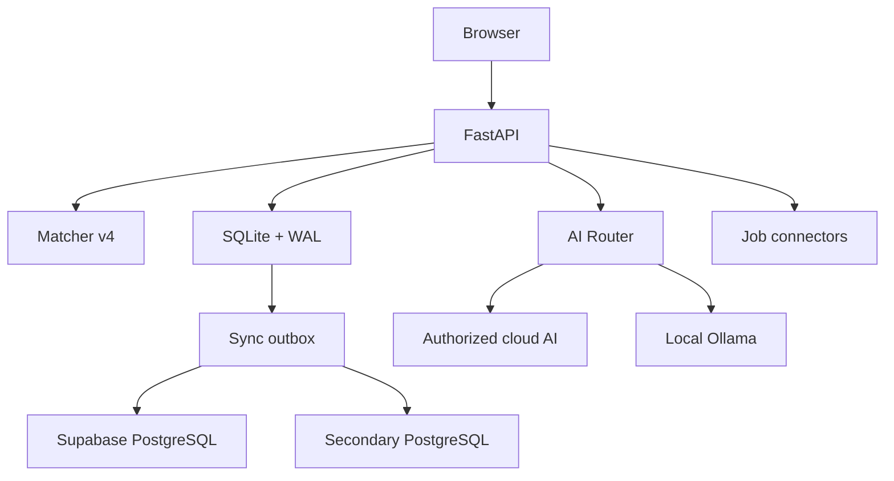

# Karna OS v1.1 architecture

SQLite is authoritative in personal mode. All job applications remain human-controlled.
Matching is deterministic; AI explains, writes and coaches but cannot override blockers.
Generated documents require approval before export. Hosted mode adds Supabase Auth,
secure cookies, user-scoped records, RLS contracts and an external scheduler.
